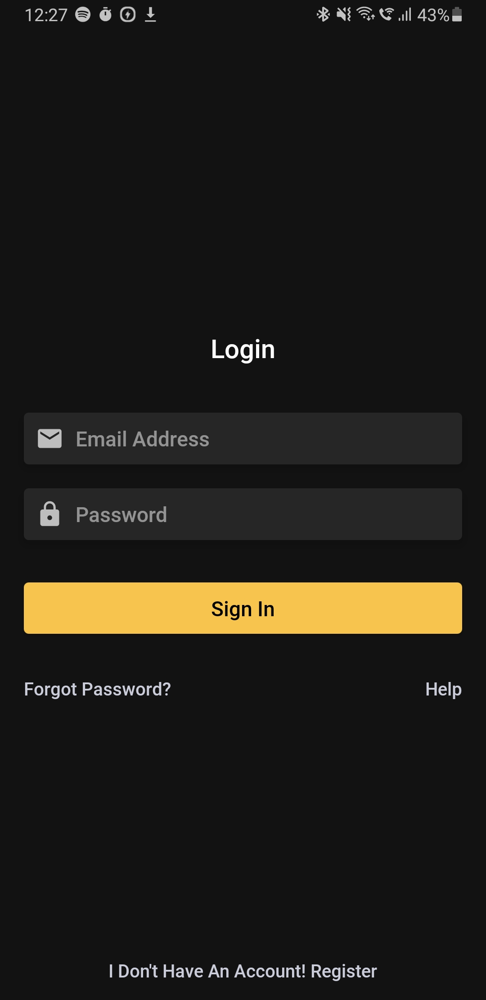
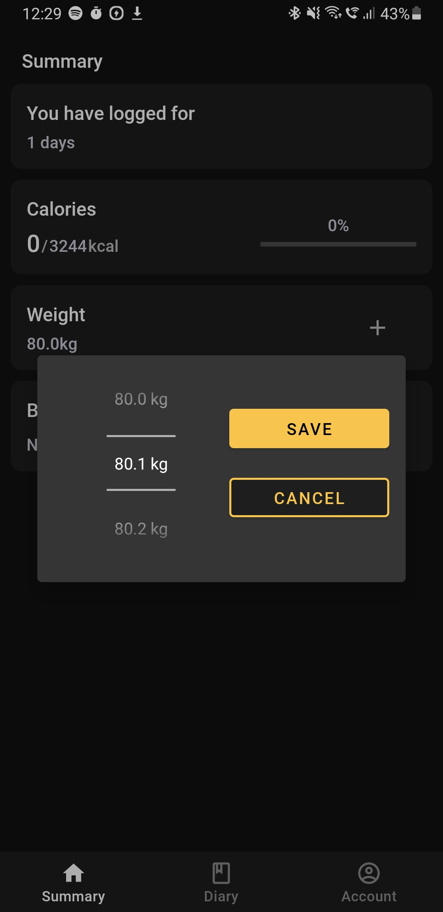
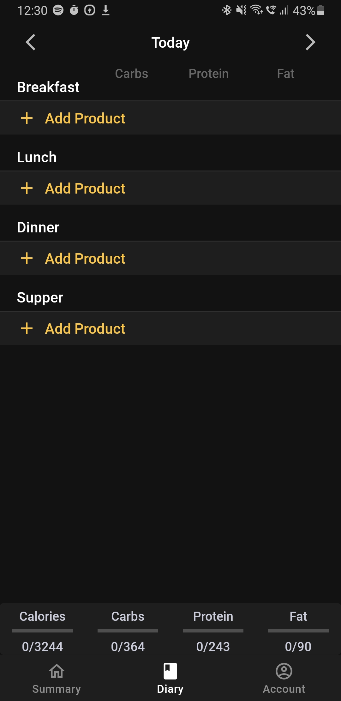

# FitnessApp

## About

This project was created to help me in my fitness journey. It contains different modules such as:

- Calories and nutrition module, in a form of a journal when user can add already existing products or add their own product
- Weight tracking module, which is responsible for showing weight progress of the user and storing weight entered by the user
- User body measurement module, which is responsible for showing users their progress and storing their measurements

It also uses firebase authentication to authenticate users.

## Screenshots from the app

### Login screen & register screen
 

### Introduction Screens
     

<!--   
   
   -->

### Summary screen & entering weight

     

### Measurements screen

### Diary, searching for existing produtct, adding new product & product screen

                

### Account and editing your nutrition settings

 

## Technologies used

- Kotlin
- Firebase
- Coroutines
- Dagger Hilt
- ROOM

## Features planned for the future

- Ads
- Charts for weight and body measurements
- Data caching(Making more use of ROOM and removing a lot of unnecessary firebase calls)
- User customization(app colors, starting screen etc.)

## Installation

You can clone this project to your Android Studio and then generate .apk file but you won't have necessary files for the application to work properly. I may release this app to the google playstore soon.

## License
[GNU AGPLv3](https://choosealicense.com/licenses/agpl-3.0/)
